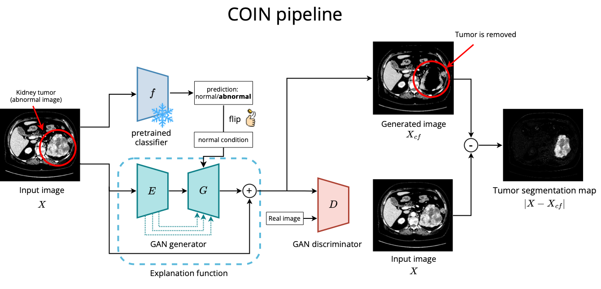
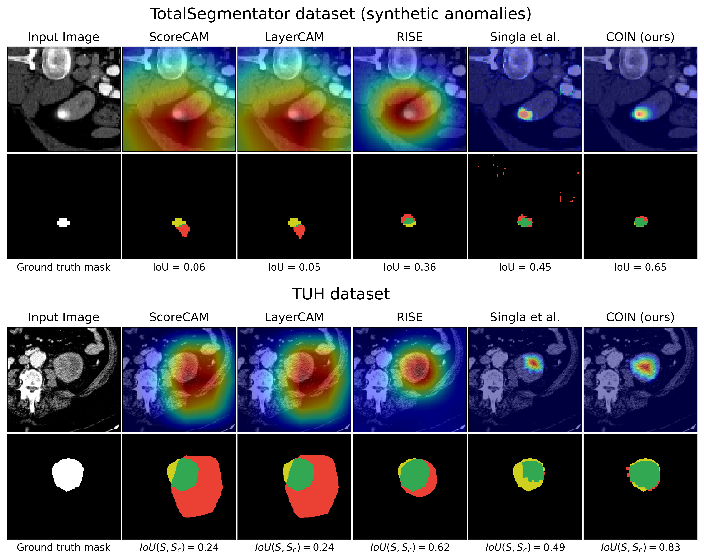
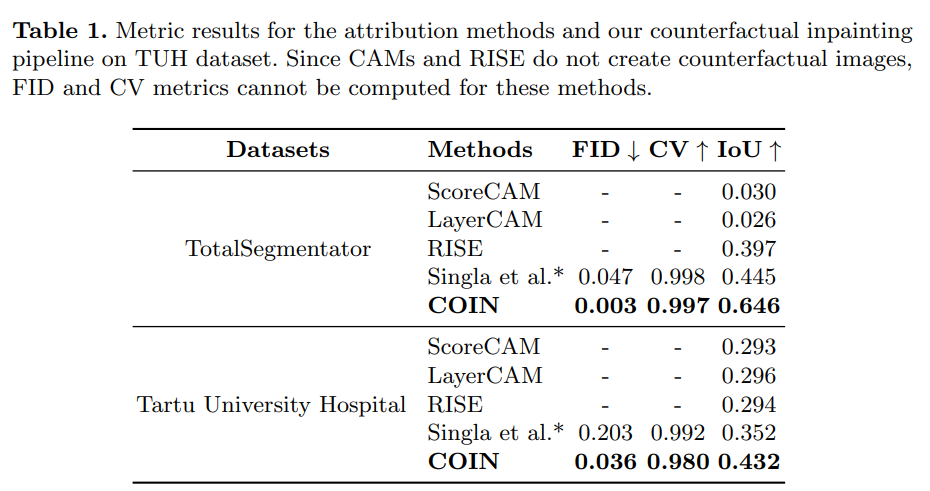
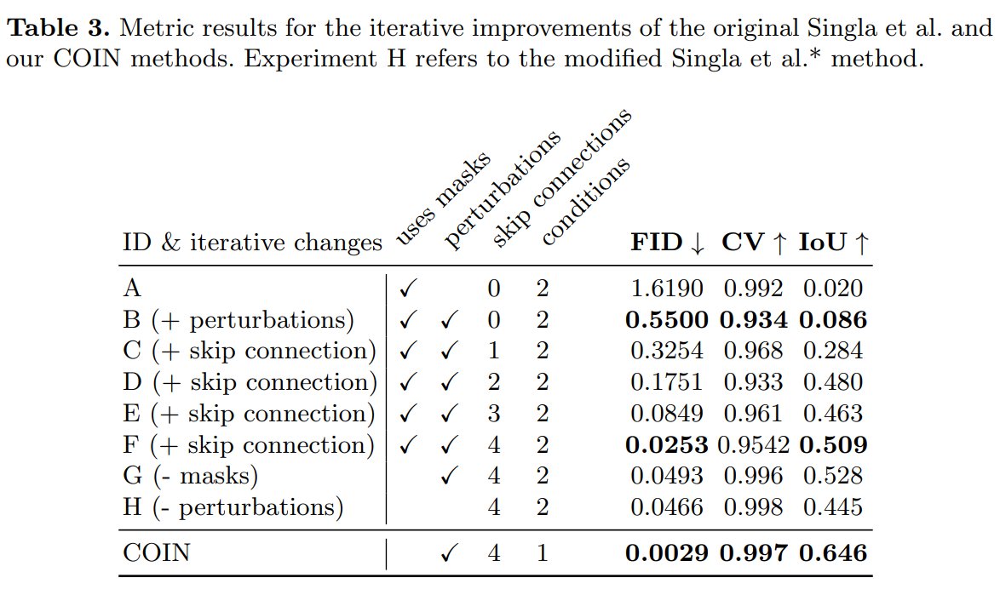

#  COIN: Counterfactual inpainting for weakly supervised semantic segmentation for medical images

<!-- [](https://arxiv.org/coming-soon) -->
<!-- [](https://github.com/LICENSE)  -->
[](https://hits.seeyoufarm.com)
[](https://github.com/Dmytro-Shvetsov/counterfactual-search/issues?q=is%3Aopen+is%3Aissue+)
[](https://github.com/Dmytro-Shvetsov/counterfactual-search/issues?q=is%3Aissue+is%3Aclosed+)  <br>


This repo is the official implementation of the paper: [COIN: Counterfactual inpainting for weakly supervised semantic segmentation for medical images](https://arxiv.org/coming-soon).

## 🤔 Introduction
Deep learning is dramatically transforming the field of medical imaging and radiology, enabling the identification of pathologies in
medical images, including CT and X-ray scans. However, the performance of deep learning models, particularly in segmentation tasks, is
often limited by the need for extensive annotated datasets. To address
this challenge, we explore the capabilities of weakly supervised semantic segmentation (WSSS) through the lens of Explainable AI (XAI) and
the generation of counterfactual explanations. Our novel counterfactual
inpainting approach (COIN) flips the predicted classification label from
abnormal to normal by using a generative model. For instance, if the
classifier deems an input medical image X as abnormal, indicating the
presence of a pathology, our generative model aims to inpaint the abnormal region, thus reversing the classifier’s original prediction label. The
approach enables us to produce precise segmentations for pathologies
without depending on pre-existing segmentation masks. Crucially, we
utilize image-level labels, which are substantially easier to acquire than
creating detailed segmentation masks. We demonstrate the effectiveness
of our method by segmenting synthetic targets and actual kidney tumors
from CT images acquired from Tartu University Hospital in Estonia.
Our findings indicate that COIN greatly surpasses established attribution methods, such as RISE, ScoreCAM, and LayerCAM, as well as an
alternative counterfactual explanation method introduced by Singla et
al. This evidence suggests that COIN is a promising approach for semantic segmentation of tumors in CT images, and presents a step forward
in making deep learning applications more accessible and effective in
healthcare, where annotated data is scarce.



## 🚀 Main Results

Visualization of the attribution and our counterfactual inpainting pipeline
methods’ predictions on TotalSegmentator and TUH datasets. For each dataset, the
bottom row depicts thresholded masks obtained from saliency maps from each method.
For each masks, colors represent outcomes in terms of true positive (green), false pos-
itive (red) and false negative (yellow) predictions. White masks denote ground truth
labels. Images are zoomed in for better clarity



### Overview of the method
Given the input image X and black-box classifier f that produces a classification label, the
image-to-image model (GAN) generates a counterfactual image Xcf with y = 0. If X
is abnormal, it is expected that Xcf no longer contains the abormal part of the input
image. Computing the absolute difference of the original image X and counterfactual
image Xcf results in a weak tumor segmentation map. While training the pipeline,
only GAN weights are updated. Classifier predictions are used for classifier consistency
loss calculation.

### Main Results on TotalSegmentator and TUH datasets



### Iterative improvements on TotalSegmentator dataset (synthetic anomalies)



## 🛠️ Quick Start
### Installation

```shell
pip install --no-cache-dir -r requirements.txt --extra-index-url https://download.pytorch.org/whl/cu117
pip install -e .
pre-commit install
```

### Training

```shell
bash tools/train.py -c <config_path>
```

### Evaluation

```shell
bash bash tools/eval_counterfactual.py -cp <model_dir> -cft 0.25 -pcf
```

<!-- ## 📘 Citation
Please consider citing our work as follows if it is helpful.
```
@article{,
    title={},
    author={},
    journal={},
    year={2024}
}
``` -->
