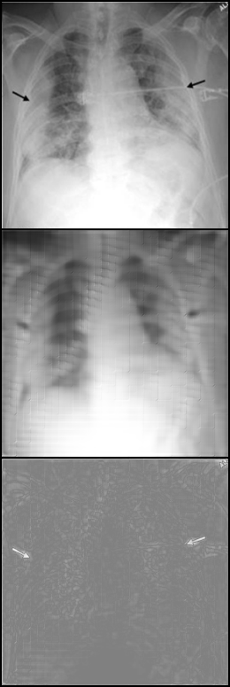
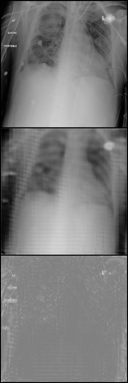
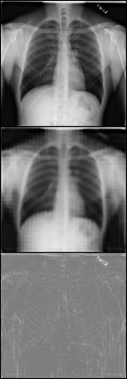
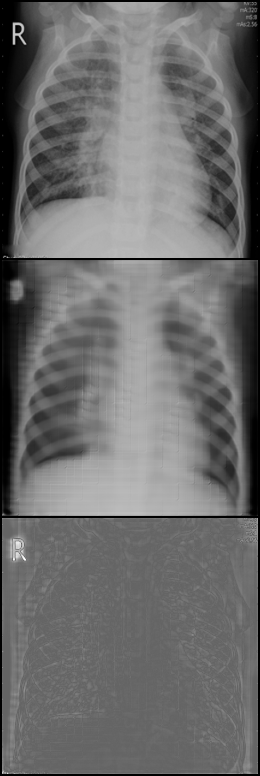

# Explaining the Black-box Smoothly — A Counterfactual Approach
This is a PyTorch implementation of the paper ["Explaining the Black-box Smoothly — A Counterfactual Approach"](https://www.sciencedirect.com/science/article/abs/pii/S1361841522003498), which employs a Conditional Generative Adversarial Network (cGAN) as an explanation function in order to audit the image classifier’s predictions.
A more detailed walk-through can be found in the final  [blog-post](https://medium.com/@shvetsovdi2/explainable-ai-counterfactual-search-for-generative-models-dca37bba2a1a).

## Introduction
Nowadays, deep learning models have exhibited impressive performance across various tasks such as classification, segmentation, and object detection. However, when it comes to deploying these models in sensitive domains, particularly in medicine, it becomes crucial to understand the specific biases they have acquired from the training data. In this project, the goal is to delve into the world of counterfactual search using generative models. Put simply, this approach aims to answer the question, “How can we modify the input image to completely change the model’s prediction?”.

## Datasets
The main dataset used for experiments is [COVID-19 Radiography Database](https://www.kaggle.com/datasets/tawsifurrahman/covid19-radiography-database?datasetId=576013&sortBy=voteCount) presenting both binary segmentation masks and classification labels (`'normal', 'lung_opacity', 'viral_pneumonia', 'covid'`) for lungs' X-ray images.

## Setting up the project
```
pip install -r requirements.freeze.txt --extra-index-url https://download.pytorch.org/whl/cu117
pip install -e .
pre-commit install
```

## Training the counterfactual cGAN
```
python train.py -c configs/experiment2.yaml
```

## Evaluating the trained explanation function
```
python eval_counterfactual.py -cp training_logs/counterfactual_lungs_cgan-May-20-2023_06+32PM-f6888be
```

## Qualitative analysis of the results

The most successful experiment is provided in the `configs/experiment2.yaml` configuration file. The weights, counterfactual examples for all the experiments can be downloaded from [here](https://drive.google.com/drive/folders/1M6q2xgq-DTc20Zz1DTQYsRbr9kTnRlJ6?usp=sharing).

In the visualizations below, the first row corresponds to the input images with posterior probability `p`. The second row is generated counterfactuals conditioned with probabilities `1-p`. The third row is the absolute difference of the first two (the brighter the pixels, the more the perturbed in those areas).

<i>An example of the “covid” lungs and a counterfactual image that <b>did flip</b> the prediction generated for the second experiment:</i>

<p align="center">

</p>

<i>An example of the “lung opacity” lungs and a counterfactual image that <b>did flip</b> the prediction generated for the second experiment:</i>

<p align="center">

</p>

<i>An example of the “normal” lungs and a counterfactual image that <b>did flip</b> the prediction generated for the second experiment:</i>

<p align="center">

</p>

<i>An example of the “viral pneumonia” lungs and a counterfactual image that <b>did flip</b> the prediction generated for the second experiment:</i>

<p align="center">

</p>
